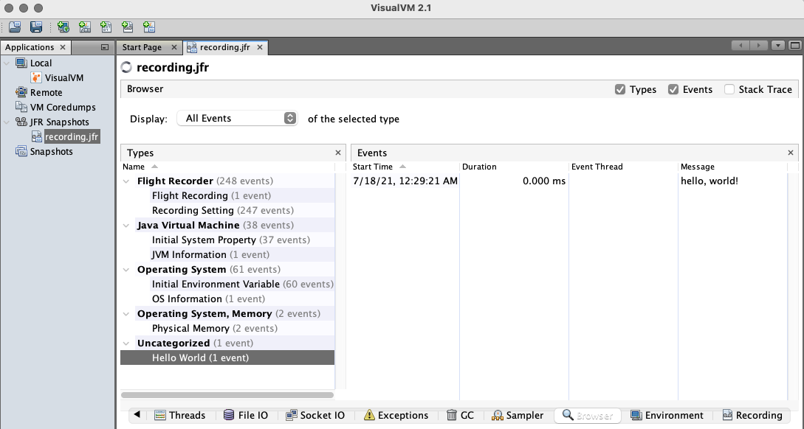

# Build and Run Native Executables with JFR

JDK Flight Recorder (JFR) is a tool for collecting diagnostic and profiling data about a running Java application, built into the JVM. 
GraalVM Native Image supports JFR events and users can use the [`jdk.jfr.Event`](https://docs.oracle.com/en/java/javase/17/docs/api/jdk.jfr/jdk/jfr/Event.html) API with a similar experience to using JFR in the Java HotSpot VM.

To record JFR events when running a native executable, enable JFR support and JFR recording as described in this guide.

> Note: JFR event recording is not yet supported on GraalVM JDK for Windows. 

## Enable JFR Support and Record Events at Run Time

To build a native executable with the JFR events support, you first need to add the `--enable-monitoring=jfr` option when invoking the `native-image` tool. Then enable the system, start a recording, and configure logging at native executable run time:
  * `-XX:+FlightRecorder`: use to enable JFR at run time
  * `-XX:StartFlightRecording`: use to start a recording on application's startup
  * `-XX:FlightRecorderLogging`: use to configure the log output for the JFR system

Follow the steps below to practice building a native executable with JFR support and recording events at run time.

> Note: You are expected to have GraalVM installed with Native Image support. The easiest way to install GraalVM is to use the [GraalVM JDK Downloader](https://github.com/graalvm/graalvm-jdk-downloader).

1. Install VisualVM by running:
    ```bash
    gu install visualvm
    ``` 
2. Save the following code to the file named _JFRDemo.java_.

    ```java
    import jdk.jfr.Event;
    import jdk.jfr.Description;
    import jdk.jfr.Label;

    public class JFRDemo {

      @Label("Hello World")
      @Description("Build and run a native executable with JFR.")
      static class HelloWorldEvent extends Event {
          @Label("Message")
          String message;
      }

      public static void main(String... args) {
          HelloWorldEvent event = new HelloWorldEvent();
          event.message = "Hello, World!";
          event.commit();
      }
    }
    ```

    This demo application consists of a simple class and JDK library classes.
    It creates an event, labelled with the `@Label` annotation from the `jdk.jfr.*` package.
    If you run this application, it will not print anything and just run that event.

3. Compile the Java file using the GraalVM JDK:
    ```shell 
    $JAVA_HOME/bin/javac JFRDemo.java
    ```
    It creates two class files: `JFRDemo$HelloWorldEvent.class`	and `JFRDemo.class`.

4. Build a native executable with the VM inspection enabled:
    ```shell
    $JAVA_HOME/bin/native-image --enable-monitoring=jfr JFRDemo
    ```
    The `--enable-monitoring=jfr` option enables features such as JFR that can be used to inspect the VM.

5. Run the executable and start recording:
    ```shell
    ./jfrdemo -XX:StartFlightRecording="filename=recording.jfr"
    ```
    This command runs the application as a native executable. The `-XX:StartFlightRecording` option enables the built-in Flight Recorder and starts recording to a specified binary file, _recording.jfr_.

6. Start [VisualVM](https://visualvm.github.io/) to view the contents of the recording file in a user-friendly way. GraalVM provides VisualVM in the core installation. To start the tool, run:

    ```shell
    $JAVA_HOME/bin/jvisualvm
    ```

7. Go to **File**, then **Add JFR Snapshot**, browse _recording.jfr_, and open the selected file. Confirm the display name and click **OK**. Once opened, there is a bunch of options you can check: Monitoring, Threads, Exceptions, etc., but you should be mostly interested in the events browsing. It will look something like this:

    

    Alternatively, you can view the contents of the recording file in the console window by running this command:

    ```shell
    $JAVA_HOME/bin/jfr print recording.jfr
    ```
    It prints all the events recorded by Flight Recorder.

### Related Documentation

- Learn more about [Native Image support for JFR events](../JFR.md) and how to further configure JFR recording and system logging.

- [Create and record your first event with Java](https://docs.oracle.com/en/java/javase/17/jfapi/creating-and-recording-your-first-event.html).