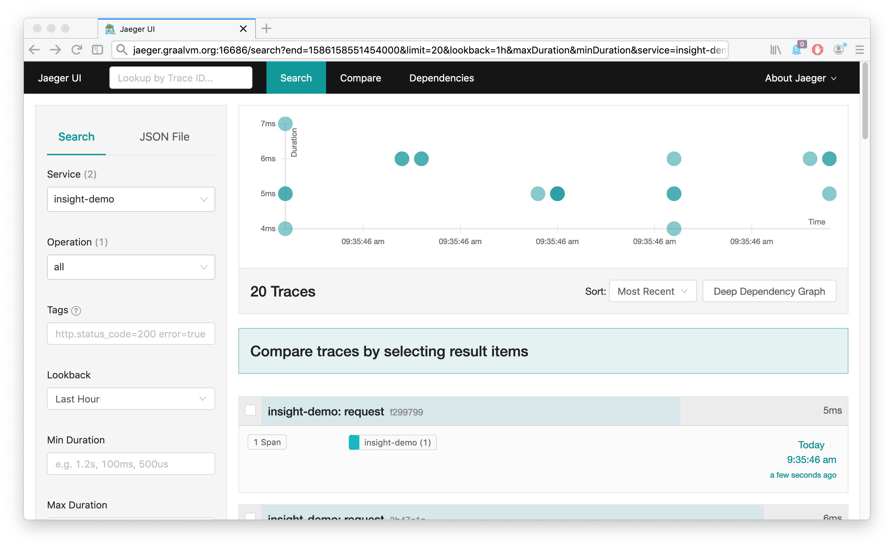

# Tracing with Insight

It is possible to use the GraalVM Insight to implement smooth, declarative, ad hoc tracing via standard [`OpenTracing API`](https://github.com/opentracing/opentracing-javascript).
The traces can be added into running application and customized on the fly to extract the right information needed to investigate any misbehavior incident.

The following examples will demonstrate the tracing capabilities with GraalVM Insight.
To start, install the Jaeger's client side instrumentation library for Node.js:

```bash
graalvm/bin/npm install jaeger-client@3.17.1
```

Now you can use the [OpenTracing API](https://github.com/opentracing/opentracing-javascript) provided by the `jaeger-client` module in your instrument `agent.js` via the `tracer` object (once it becomes available, it will discussed later in this guide):

```js
let initialize = function(tracer) {
    var counter = 0;

    insight.on('enter', function(ctx, frame) {
        const args = frame.args;
        if ('request' !== frame.type || args.length !== 2 || typeof args[0] !== 'object' || typeof args[1] !== 'object') {
            return;
        }
        const req = args[0];
        const res = args[1];
        const span = tracer.startSpan("request");
        span.setTag("span.kind", "server");
        span.setTag("http.url", req.url);
        span.setTag("http.method", req.method);
        res.id = ++counter;
        res.span = span;
        console.log(`agent: handling #${res.id} request for ${req.url}`);
    }, {
        roots: true,
        rootNameFilter: 'emit',
        at: {
            sourcePath: '.*events.js'
        }
    });

    insight.on('return', function(ctx, frame) {
        var res = frame['this'];
        if (res.span) {
            res.span.finish();
            console.log(`agent: finished #${res.id} request`);
        } else {
            //Caused, for example, by Tracer itself connecting to the Jaeger server
        }
    }, {
        roots: true,
        rootNameFilter: 'end',
        at: {
            sourcePath: '.*_http_outgoing.js'
        }
    });
    console.log('agent: ready');
};
```

The system hooks into `emit('request', ...)` and `res.end()` functions which are used to initialize a response to an HTTP request and finish it.
Because the `res` object is a dynamic JavaScript object, it is possible to add `id` and `span` attributes to it in the `enter` handler of the `emit` function from the source `events.js`.
Then it is possible to use these attributes in the `return` handler of the `end` function.

GraalVM Insight provides access to `frame` variables and their fields.
As such, the instrument can read value of `req.url` or `req.method` and provide them as `span.setTag` values to the OpenTracing server.

With this instrument, it is just a matter of being able to enable it at the right time.
Check the [Embedding Insight into Node.js Application](Insight-Embedding.md) section to see how to create an admin server and apply any trace scripts (including OpenTracing based ones) dynamically when needed.
For purposes of this guide, something simpler will be used.

Enable the instrument when the `jaeger` object is provided to it:

```js
let initializeJaeger = function (ctx, frame) {
    insight.off('enter', initializeJaeger);

    let jaeger = frame.jaeger;

    var initTracer = jaeger.initTracer;
    console.log('agent: Jaeger tracer obtained');

    // See schema https://github.com/jaegertracing/jaeger-client-node/blob/master/src/configuration.js#L37
    var config = {
      serviceName: 'insight-demo',
      reporter: {
        // Provide the traces endpoint. This forces the client to connect directly to the Collector and send
        // spans over HTTP
        collectorEndpoint: 'http://localhost:14268/api/traces',
        // Provide username and password if authentication is enabled in the Collector
        // username: '',
        // password: '',
      },
      sampler: {
          type : 'const',
          param : 1
      }
    };
    var options = {
      tags: {
        'insight-demo.version': '1.1.2',
      },
    //  metrics: metrics,
      logger: console,
      sampler: {
          type : 'const',
          param : 1
      }
    };

    var tracer = initTracer(config, options);
    initialize(tracer);
};

insight.on('return', initializeJaeger, {
  roots: true,
  rootNameFilter: 'jaegerAvailable'
});
```

This instrument needs help from the main server script.
Let the `server.js` obtain the `jaeger-client` module and pass it to the agent via the `jaegerAvailable` function.
Then it creates a typical HTTP server.
The content of `server.js` is:

```js
function jaegerAvailable(jaeger) {
    console.log("Providing Jaeger object to the agent");
}
jaegerAvailable(require("jaeger-client"));

const http = require("http");
const srv = http.createServer((req, res) => {
    console.log(`server: obtained request ${res.id}`);
    setTimeout(() => {
        res.write(`OK# ${res.id}`);
        console.log(`server: replied to request ${res.id}`);
        res.end();
    }, 5);
});
srv.listen(8080);
```

With these two files you can launch the node application as well as the agent.
But, first of all, start the Jaeger server:

```bash
docker run -d --name jaeger \
-e COLLECTOR_ZIPKIN_HTTP_PORT=9411 \
-p 5775:5775/udp   -p 6831:6831/udp   -p 6832:6832/udp \
-p 5778:5778   -p 16686:16686   -p 14268:14268   -p 9411:9411 \
jaegertracing/all-in-one:latest

graalvm/bin/node --insight=agent.js server.js
Providing Jaeger object to the agent
agent: Jaeger tracer obtained
Initializing Jaeger Tracer with RemoteReporter and ConstSampler(always)
agent: ready
```

Now you can connect to the Jaeger UI available at [http://localhost:16686/](http://localhost:16686/) and put the server under some load:

```bash
ab -c 10 -n 10000 http://localhost:8080/
```

The server prints to the console detailed information while handling the requests and the Jaeger UI fills with the traces:



This completes the guide how to enhance a plain Node.js application with tracing.
The traces remain separated in its own `agent.js` file and can be applied at start time (demonstrated here) or [dynamically](Insight-Embedding.md) when needed.

### What to Read Rext

To learn more about Insight and find some challenging tasks, go to the [Insight Manual](Insight-Manual.md).
